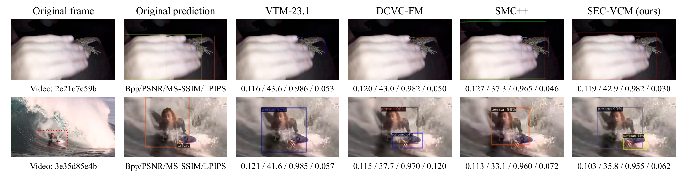
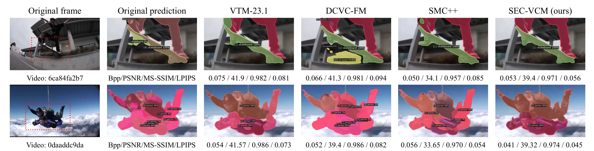

# Symmetric Entropy-Constrained Video Coding for Machines

Based on the DCVC-HEM baseline architecture (ACM MM 2022), extended with our proposed modules (bi-directional entropy-constraint and semantic-pixel dual-path fusion).

## Cases Visualziation





## Model Weights

The pre-trained model weights are **not publicly available** at this moment, as they are tied to ongoing projects, patents, and commercial usage.

## Requirements

- Python 3.8+
- PyTorch >= 2.0.0
- See `requirements.txt` for full list

## Acknowledgement

This project builds upon:

- [DCVC-HEM](https://github.com/microsoft/DCVC) — Base video codec architecture
- [CompressAI](https://github.com/InterDigitalInc/CompressAI) — Learned compression primitives
- [Mask2Former](https://github.com/facebookresearch/Mask2Former) — Semantic teacher model
- [DINOv2](https://github.com/facebookresearch/dinov2) — Visual foundation model
- [Detectron2](https://github.com/facebookresearch/detectron2) — Detection framework

## 📝 Citation

If you find this work useful for your research, please cite:

```bibtex
@article{sun2026secvcm,
  title   = {Symmetric Entropy-Constrained Video Coding for Machines},
  author  = {Sun, Yuxiao and Liu, Meiqin and Yao, Chao and Tang, Qi and Jin, Jian and Lin, Weisi and Dufaux, Frederic and Zhao, Yao},
  journal = {IEEE Transactions on Image Processing},
  year    = {2026},
  doi     = {10.1109/TIP.2026.3705185}
}
```

## 📄 License

This project is released under the MIT License. Third-party components retain their original licenses.
